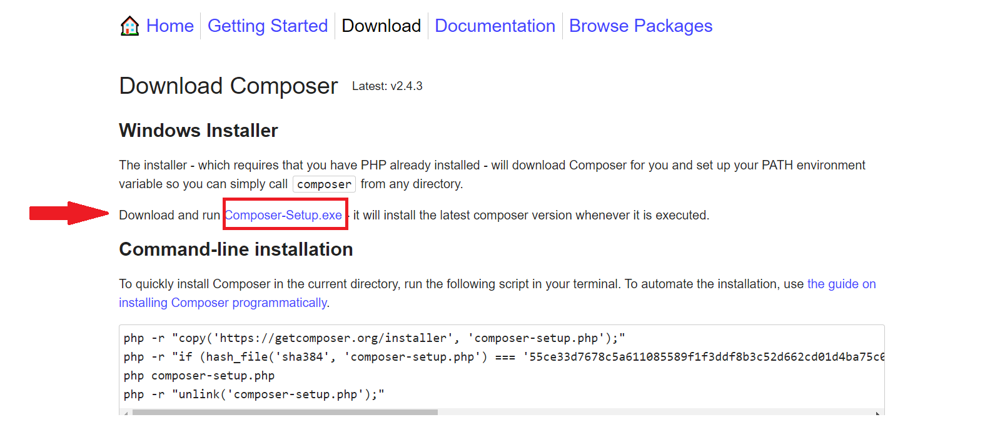

# Orientações de preparação de ambiente
Para rodar essa aplicação laravel, é necessário ter uma versão de PHP e MSQL instalada em sua máquina.
Desse modo, recomendo que utilize o XAMPP, que é uma aplicação que configura automaticamente essas duas ferramentas para você.

## Instalação XAMPP
Para isso acesse o site abaixo, faça o download da versão mais rescente do XAMMP e instale em sua máquina:
> url(https://www.apachefriends.org/pt_br/download.html)

## Instalação Composer
O composer é um gerenciador de pacote que permite, com simples comandos, gerenciar as bibliotecas e pacotes utilizados em uma aplicação.
Acesso o site abaixo, faça o download e instale o composer
> url(https://getcomposer.org/download/)

## Instalação do Visual Studio Code - VSCode
O VsCode é uma das melhores IDEs para devenvolvimento de software e tem crescido cada vez mais, pois é muito leve em comparação às demais IDEs e apresenta muitos recursos.

Acesse o site abaixo e instale a ultima versão do VsCode para seu sistema operacional:
> url(https://code.visualstudio.com/download)

### instalação de pugins do VsCode para o Laravel
O VsCode oferece a possibilidade de instalação de plugins para facilitar o desenvolvimento de acordo à linguagem e/ou framework que deseja utilizar. O plugin básico que você vai precisar é o Laravel Extension Pack, essa extensão (plugin) vai automaticamente instalar tudo que você precisa para o Laravel. Para facilitar esse processo, deixei um vídeo abaixo, com sugestões de diversos plugins. Procure instalar primeiro a extensão que falei acima e se desejar instala as demais sugeridas no vídeo. 
> url(https://www.youtube.com/watch?v=tqOr_scGWd0)

## Clonando o projeto
O Github possibilita que os usuários possam baixar todo um projeto de forma simplificada.
Assista ao vídeo abaixo e faça o clone desse projeto. O vídeo vai ensinar como criar, clonar, fazer commit e push em um repositório,
você só precisa a prender como clonar nesse momento.
> url(https://youtu.be/nAHVEzDBVeo?t=120)

# Colocando a API para funcionar
Ao instar o XAMPP, vc pode abrí-lo em seu computador, pesquisando por ele no menu iniciar. Ative as opções Apache e MSQL, como mostrado
na imagem abaixo:

Dessa forma você está ligando o serviço apache e o MSQL, sendo assim possível criar um banco de dados local com o PhpMyAdmin

## Criando um banco de dados
Como o serviço MSQL ligado, você terá acesso ao botão admin, como mostrado na imagem abaixo. Clique nele e o PhpMyAdmin será aberto no browser (google chrome ou outro que esteja usando)

Em seguida clique no botão novo, será aberto uma tela ao lado para inserir o nome do banco de dados. Defina o nome de dados exatamente como: treinamentoQA

Em seguida clique em criar, como mostra a imagem abaixo

